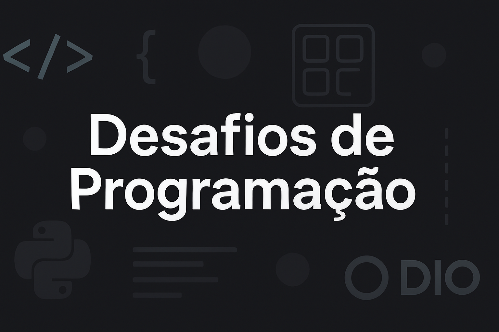

  

# 💻 Desafios da DIO

Repositório criado para reunir e organizar as soluções dos **desafios práticos propostos pela Digital Innovation One (DIO)**. Aqui você encontrará códigos, algoritmos e projetos desenvolvidos durante minha jornada de aprendizado na plataforma, abordando temas como lógica de programação, estruturas de dados, orientação a objetos, APIs, bancos de dados, entre outros.

## 📚 Conteúdo

Este repositório contém desafios divididos por temas e tecnologias, conforme propostos nos bootcamps e cursos da DIO. Os principais tópicos abordados incluem:

- 🔢 Lógica de Programação  
- 🧠 Estruturas de Dados  
- 💡 Algoritmos  
- ☕ Java  
- 🐍 Python  
- 💻 JavaScript  
- 🧪 Testes e Depuração  
- 🌐 Consumo de APIs  

## 📁 Organização dos Arquivos

> Cada pasta agrupa os desafios por linguagem ou categoria. Os nomes dos arquivos representam o tema ou problema resolvido.

desafiosDaDIO/

|── java/

|  └─── desafio-nome.java

|── python/

|  └── desafio-nome.py

|── logica/

|  └── desafio-nome.txt

└── README.md

Os desafios estão organizados em pastas nomeadas de acordo com os temas ou cursos da DIO. Dentro de cada pasta, há arquivos com os códigos-fonte, bem como instruções quando necessário.

> A estrutura poderá ser expandida conforme mais desafios forem adicionados.

## 🚀 Objetivo

Este repositório serve como um portfólio técnico, além de ajudar na consolidação do conhecimento adquirido com os desafios. É também uma forma de compartilhar meu progresso e auxiliar outros desenvolvedores que estejam trilhando um caminho semelhante.

## 🛠️ Tecnologias Utilizadas

- Java
- Python
- JavaScript
- Git e GitHub
- IDEs como VSCode e Eclipse

## 🤝 Contribuições

Atualmente este repositório é de uso pessoal, mas se você quiser sugerir melhorias ou compartilhar outros desafios, sinta-se à vontade para abrir uma _issue_ ou fazer um _pull request_.

## 📌 Sobre a DIO

A [Digital Innovation One](https://www.dio.me/) é uma plataforma de educação gratuita para desenvolvedores, que oferece cursos, bootcamps e desafios práticos com foco no mercado de trabalho.

---

  Desenvolvido por <strong>Gustavo Ventura</strong> · 
  <a href="https://www.linkedin.com/in/gtvnv">LinkedIn</a>

